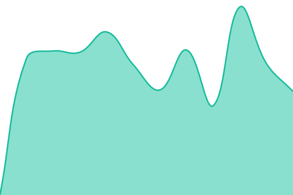
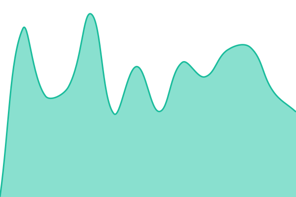

# [📈 Live Status](https://status.mwmbl.org): <!--live status--> **🟩 All systems operational**

This repository contains the open-source uptime monitor and status page for [Mwmbl](https://mwmbl.org), powered by [Upptime](https://github.com/upptime/upptime).

With [Upptime](https://upptime.js.org), you can get your own unlimited and free uptime monitor and status page, powered entirely by a GitHub repository. We use [Issues](https://github.com/mwmbl/upptime/issues) as incident reports, [Actions](https://github.com/mwmbl/upptime/actions) as uptime monitors, and [Pages](https://status.mwmbl.org) for the status page.

<!--start: status pages-->
<!-- This summary is generated by Upptime (https://github.com/upptime/upptime) -->
<!-- Do not edit this manually, your changes will be overwritten -->
<!-- prettier-ignore -->
| URL | Status | History | Response Time | Uptime |
| --- | ------ | ------- | ------------- | ------ |
|  [Mwmbl Front End](https://mwmbl.org) | 🟩 Up | [mwmbl-front-end.yml](https://github.com/mwmbl/upptime/commits/HEAD/history/mwmbl-front-end.yml) | 

 547ms
     
 | 

<a href="https://status.mwmbl.org/history/mwmbl-front-end">97.15%</a>
    

|  [Mwmbl API](https://api.mwmbl.org/api/v1/search/?s=test) | 🟩 Up | [mwmbl-api.yml](https://github.com/mwmbl/upptime/commits/HEAD/history/mwmbl-api.yml) | 

 649ms
     
 | 

<a href="https://status.mwmbl.org/history/mwmbl-api">96.31%</a>
    

|  [Mwmbl Book](https://book.mwmbl.org) | 🟩 Up | [mwmbl-book.yml](https://github.com/mwmbl/upptime/commits/HEAD/history/mwmbl-book.yml) | 

 201ms
     
 | 

<a href="https://status.mwmbl.org/history/mwmbl-book">100.00%</a>
    

<!--end: status pages-->

[**Visit our status website →**](https://status.mwmbl.org)

## 📄 License

- Powered by: [Upptime](https://github.com/upptime/upptime)
- Code: [MIT](./LICENSE) © [Anand Chowdhary](https://anandchowdhary.com), supported by [Pabio](https://pabio.com)
- Data in the `./history` directory: [Open Database License](https://opendatacommons.org/licenses/odbl/1-0/)
